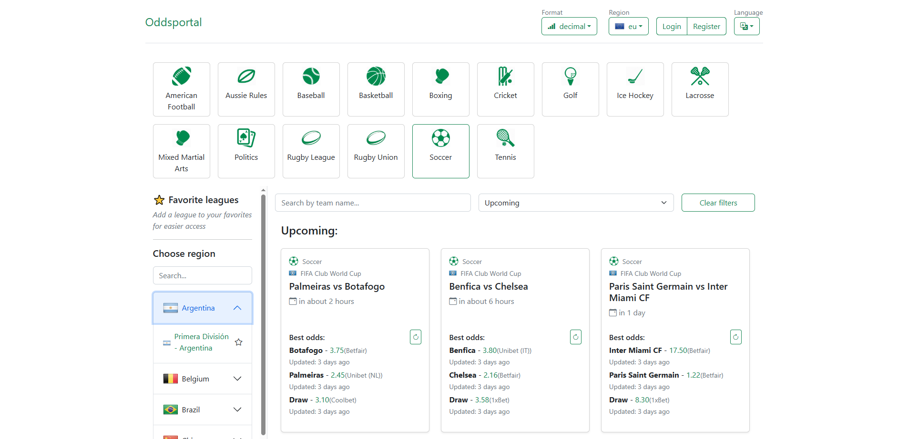

# Oddsportal - Betting Odds Comparison Tool

 
A web application designed to compare betting odds for various sporting events. The application integrates with external APIs to fetch and synchronize data about leagues, events, and odds.

**Live demo is available at:** [https://oddsportal-app.duckdns.org](https://oddsportal-app.duckdns.org)


## Key Features

-   Browse sports events divided by disciplines, regions, and leagues.
-   Automated, periodic synchronization of data (leagues, events, odds) from external APIs.
-   Filtering events by name, date, sport, and league.
-   User authentication system based on JWT (registration, login).
-   Ability for logged-in users to add leagues to a more accessible "favorites" list.
-   Multi-language interface (i18n) with support for Polish and English.
-   Fully automated deployment process (CI/CD) using GitHub Actions.
-   Database backup system and production error monitoring with Sentry.io.


## Tech Stack

### Backend
* **PHP 8.2**
* **Symfony 6.4+**

### Frontend
* **Vue 3** 
* **Pinia** (for state management)
* **Vite** (as a build tool)
* **Bootstrap 5** (for the visual layer)
* **vue-i18n** (for handling translations)

### Infrastructure & Deployment
* **Docker** & **Docker Compose** (for containerization)
* **Nginx** (as a web server)
* **MySQL 8.0** (as a database)
* **AWS EC2** (as the production server)
* **AWS S3** (for storing database backups)
* **GitHub Actions** (for CI/CD automation)
* **Sentry.io** (for production error monitoring)


## Local Setup

Docker and Docker Compose (v2 plugin) are required to run this project locally. On Windows and Mac, installing **Docker Desktop** includes both tools.


1.  **Clone the repository:**
    ```bash
    git clone https://github.com/DamianKlata1/oddsportal
    cd oddsportal
    ```

2.  **Configure Environment Variables:**
        Copy the `.docker/.env` file to a new file named `.docker/.env.local` and fill in your data (e.g., API keys). Similarly, copy the root `.env` file to `.env.local`.


3.  **Build and Run the Docker Containers:**
    Inside `.docker/` directory run:
    ```bash
    docker compose up -d --build
    ```

4.  **Install PHP Dependencies:**
    ```bash
    docker compose exec php composer install
    ```

5.  **Install JavaScript Dependencies:**
    ```bash
    docker compose exec php npm install
    ```
    
6.  **Prepare the database**
    ```bash
    # Enter php container
    docker compose exec php bash
    
    # Inside container run following commands:
    php bin/console doctrine:database:create

    php bin/console doctrine:migrations:migrate

    php bin/console doctrine:fixtures:load --no-interaction

    php bin/console app:synchronise-sports-data
    exit
    ```
7.  **Run the Vite Development Server:**
    ```bash
    docker compose -f .docker/docker-compose.yml exec php npm run dev
    ```


8.  **You're all set!**
The application is now available at **`http://localhost:80`**.

8.  **Login with Test User:**
    The `doctrine:fixtures:load` command creates a default users for testing purposes.
    > **Email:** `user@test.com`  
    > **Password:** `password123`  
    >
    > **Email:** `admin@test.com`  
    > **Password:** `password123`  
    > 

## Maintenance & Periodic Tasks (Cron Jobs)

The application includes console commands for data maintenance.

### Data Synchronization
These commands are used to fetch initial data from external APIs.
```bash
php bin/console app:synchronise-sports-data
```

### Deleting Past Events
To prevent the database from growing with outdated data, you should periodically delete past events.
```bash
php bin/console app:delete-past-events
```
It is best to automate these commands using a cron job. Example crontab entry to run daily at 4:05 AM:
```
5 4 * * * php bin/console app:delete-past-events
```

## Production deployment

Deployment to the production environment is fully automated using **GitHub Actions**. Every  `push` to the `main` branch automatically triggers a workflow that:
1.  Builds production-ready Docker images.

2.  Pushes them to a container registry (Docker Hub).

3.  Connects to the EC2 server and pulls the new images.

4.  Restarts the containers and runs database migrations.
